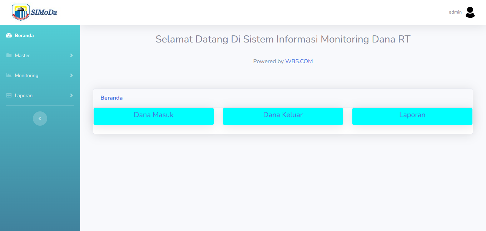

# 💰 Sistem Informasi Monitoring Dana RT

Sistem berbasis web untuk memonitor dan mencatat pemasukan dan pengeluaran dana di tingkat RT (Rukun Tetangga). 
Dibangun menggunakan **CodeIgniter 3**, **PHP 8.1**, dan **MariaDB** untuk memudahkan pengelolaan keuangan secara transparan dan akuntabel.
Sistem ini dibuat untuk membantu transparansi dan efisiensi pengelolaan dana RT. 
Mudah digunakan, ringan dijalankan, dan fleksibel dikembangkan sesuai kebutuhan lokal!

---

# 📌 Spesifikasi Proyek

| 💻 Komponen         | 🛠️ Teknologi                                                                 |
|---------------------|------------------------------------------------------------------------------|
| ⚙️ Framework        |  [CodeIgniter 3](https://codeigniter.com) |
| 🧠 Bahasa Pemrograman |  PHP v8.1                      |
| 🛢️ Database         |  MariaDB |
| 🌐 Web Server       |  Apache (via XAMPP) |
| 🧮 Basis Data       |  RDBMS

---

🧭 Fitur Utama

🏠 Dashboard
	- Ringkasan dana masuk & keluar
	- Laporan
	- Informasi terbaru
	
	

💸 Monitoring Dana Masuk
	- Input data pemasukan RT
	- Rincian sumber dana
	- Tanggal & nominal dana masuk

🧾 Monitoring Dana Keluar
	- Input kebutuhan dan biaya
	- Bukti pengeluaran (upload file opsional)
	- Tanggal pengeluaran

📑 Laporan
	- Rekap data dana masuk & keluar
	- Cetak laporan bulanan/tahunan
	- Filter berdasarkan tanggal

👨‍💼 Manajemen Pegawai
	- Tambah/edit/hapus pegawai
	- Akses login multiuser (jika diterapkan)
	
---

🚀 Cara Menjalankan di Lokal:

1. Clone repository:
	git clone https://github.com/username/dandes.git

2. Pindahkan ke direktori htdocs (jika pakai XAMPP).

3. Import file dandes.sql ke phpMyAdmin.

4. Edit konfigurasi database:
	- application/config/database.php
	
5. Jalankan melalui browser:
	http://localhost/dandes/
	
---

🙋‍♂️ Kontak Pengembang
📧 Email: [yudyasukma2@gmail.com]

---

🧑‍💻 Kontribusi
Pull request dan saran pengembangan sangat disambut! Jangan ragu untuk fork dan modifikasi proyek ini.

📃 Lisensi
Proyek ini bersifat open-source dan dapat digunakan untuk pembelajaran atau pengembangan lebih lanjut. Silakan cantumkan kredit kepada pengembang asli bila digunakan secara publik.
